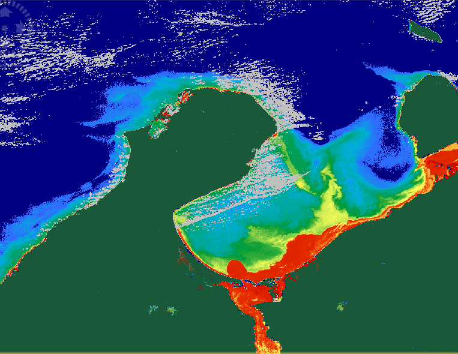




## Ejemplos - Tutoriales

De cada paquete enunciado se expondran ejemplos especificos, utilidad, de donde se toman los datos, como se porcesan y alguna otra informacion clave para tener un primer acercamiento y si es de interes poder profundizar

## Imagenes

 para procesar a una imagen Ocean Color o colores del oceano, donde es posible conocer concentraciones de clorofila o la cantidad de material total suspendido")




## Codigo

```bash
python version --version

import pandas as pd
import numpy as np
import torch
```

Python por ser de los lenguajes de programacion multiproposito por excelencia.

[Github](https://github.com/grammaloreto) donde se puede profundizar

## Graficas


## Plataformas, software, notebooks, artículos

### y Mas....

