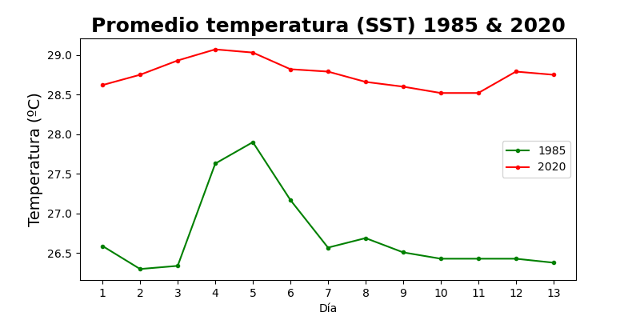
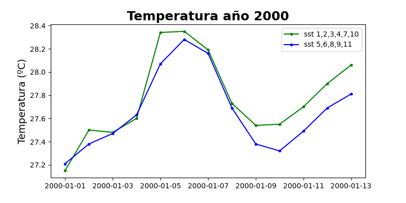

## Resumen

La facilidad para acceder a datos físicos del océano ha mejorado notoriamente y en la actualidad son accesibles a tiempo real. 

STT como se le conoce en inglés (Sea Surface Temperature) es quizá una de las métricas con mayor registro a través del tiempo. Es posible encontrar datos de temperaturas del mar de la década de los años 80's, incluso en algunos casos de los 70´s.

Los mecanismos actuales son muy confiables y son varios los objetos que se encargan de tomar estos registros. Tanto a nivel satelital para después ser validados por boyas u objetos que están en "contacto" más estrecho, son un ejemplo.

Debido a la gran cantidad de datos espacio-temporales de temperatura superficial del mar (sst) que se generan día a día, la mejor forma para extraer, visualizar y pronosticar información relevante es mediante ciencia de datos.

El propósito del tutorial es tomar datos de sst de décadas pasadas y cuantificar cuanto ha aumentado la temperatura en el Parque Nacional Natural Islas del Rosario en Colombia, caracterizado por una cobertura alta de especies coralinas pero que en los últimos años ha disminuido debido a enfermedades (blanqueamiento), consecuencia de las altas temperaturas del mar.

De igual forma, se harán pronósticos a partir de las temperaturas de los últimos años, para saber cómo se comportará esta variable a futuro en los puntos evaluados del parque natural. 

Estas predicciones se realizarán con métodos de ciencia de datos a través de Python o librerías (frameworks) de Machine Learning como PyTorch o Prophet de Facebook.

### Pre-requisitos

- Pandas básico.
- Fundamento de datos **espacio-temporales.**

## Datos

### Google Earth Engine (GEE)

Si está familiarizado con Google Earth, esta herramienta es quizá muchísimo más funcional, agrupando un catálogo extremadamente completo de imágenes satelitales y datasets.

Para usarlo solo es necesario tener una cuenta de Google y [registrarse.](https://earthengine.google.com)

Una vez inscrito puede revisar los datasets de interés. Cada uno tiene su código de ejemplo, ya sea para trabajar con el editor de JavaScript o la API de Python. Vale la pena revisar la documentación y fortalecer conceptos.

El dataset usado para colectar las SST o temperaturas superficiales del mar es el de [NOAA.](https://developers.google.com/earth-engine/datasets/catalog/NOAA_CDR_OISST_V2_1)

En este [repositorio de GitHub](https://github.com/grammaloreto/EarthEngine/blob/main/NOAA_oiSST/SeaSurfaceTemperature_IslasRosario.js) se encuentra el bloque de código necesario para obtener las temperaturas en ciertos puntos específicos del Parque Nacional Natural Islas del Rosario.

Puede cambiar las coordenadas de los puntos de interés y las fechas. En el enlace de NOAA puede encontrar un ejemplo diferente y más información del dataset.

Finalmente al tener los puntos o el área de interés con las temperaturas en las fechas indicadas, es posible descargar los datos en archivos CSV desde el mismo GEE.

### Transformación

En la mayoría de casos los datos con los que trabajamos no se encuentran en la forma en que queremos. Por este motivo es necesario realizar algunos procesos para poder "adecuarlos", "pulirlos" o simplemente transformarlos.

En nuestro caso particular, las temperaturas que obtenemos de GEE no están en grados centígrados (°C), además el formato de las fechas del archivo CSV no es reconocido por Python (pandas) por lo que es necesario cambiarlo.

Empecemos con las fechas. En el notebook de trabajo importe la dependencia **datetime** para convertir la columna **Time** de nuestra base de datos (df) a un tipo reconocible.

```bash
import datetime as dt

df["Time"] = pd.to_datetime(df["Time"])
```

Respecto a las temperaturas (en una columna llamada sst) lo primero que hay que hacer es transformar los datos de objetos a valores numéricos.

```bash
df["sst_replace"] = df["sst"].str.replace(",","")
df["sst_replace"] = pd.to_numeric(df["sst_replace"])
```
En la primera línea de código se elimina la coma con la que se descargan las temperaturas de GEE a una columna nueva llamada *"sst_replace"*. En la segunda línea de código convertimos estos valores a tipo numérico.

Para terminar, los valores resultantes del proceso anterior se multiplican por 0.01 para obtener temperaturas en grados centígrados (°C) en una columna nueva llamada *"sst"*.

```bash
df["sst"] = df["sst_replace"]*(0.01)
```
## Temperatura Superficial del Mar (SST) en Islas de Rosario - Colombia 

De Google Earth Engine (GEE) se extrajeron los datos de Temperatura Superficial del Mar (SST) de 11 puntos del Parque Nacional Natural Islas del Rosario ubicado en el Caribe colombiano. 

Los datos son básicamente una media diaria de 13 días de diferentes años. En este caso del 1 al 13 de enero de los años 1985, 2000 y 2020. 

### Descripción - Visualización

Para tener una primera fotografía de la base de datos resultante después de las transformaciones, puede usar la función *head* que muestra las primeras 5 filas. 

Si quiere tener una radiografía más completa donde aparezca la media, desviación, percentiles, número de valores y otra informacion relevante use la funcion *describe*.

```bash
df.head()
df.describe()
```

Las gráficas son otra forma de conocer bien nuestros datos para observar patrones y determinar cuál es la mejor forma de tratarlos.





 en el Parque Nacional Natural Islas del Rosario - Colombia.")


La Temperatura Superficial del Mar (SST) máxima alrededor de los 11 puntos del parque aumentó 1,72 ºC de 1985 a 2020 (27,90 a 29,07 ºC). Más dramática es la comparación de medias de SST que muestra aguas más calientes con un aumento de 1,95 ºC. Esta nueva configuración de temperaturas afecta a los corales (blanqueamiento) y a la diversidad de especies marinas. 

Si quiere revisar con mas detalle datos, código o el proceso en sí, puede dirigirse a [👉este repositorio de GitHub.](https://github.com/grammaloreto/SeaSurfaceTemperature-SST-)

## Pronóstico datos Espacio-Temporales

Con los datos espacio-temporales (en nuestro caso la temperatura superficial del mar sst desde el año 1985 al 2020) es común o habitual hacer pronósticos, predecir comportamientos, valores, tendencias etc.

Hay variedad de herramientas y técnicas para realizar pronósticos con los distintos tipos de datos. Con los *espacio-temporales*, [Prophet](https://facebook.github.io/prophet/) de Facebook o las redes neuronales recurrentes LSTM (Long Short Term Memory) pueden ser buenas opciones.  

### Redes Neuronales Recurrentes LSTM

LSTM es un tipo de red neuronal recurrente (RNN) muy común en predicciones bursátiles y PLN (definidos en nuestros docs). 

Con la temperatura de la superficie del mar (SST) de cada punto de interés del Parque Nacional Natural Islas del Rosario, se entrenó un modelo para predecir valores precisos de temperatura y poder manejar las enfermedades de los corales en un futuro próximo.

 de temperatura superficial del mar (SST) para la estación 1 en el Parque Nacional Natural Islas del Rosario - Colombia.")

Este proceso se repitió para cada una de las otras 10 estaciones. Para profundizar puede revisar [👉 aquí.](https://github.com/grammaloreto/SeaSurfaceTemperature-SST-/tree/main/timeSeriesPrediction) 

### Prophet

Con el procedimiento de Prophet (Desarrollado por el equipo de inteligencia artificial de Facebook) se realiza una metodología diferente para pronosticar las temperaturas.

Se tomó la temperatura de la superficie del mar (SST) de 2020-2021 en los 11 puntos del Parque Nacional Natural Islas del Rosario para así tener un pronóstico de SST de los meses (100 días) posteriores al último día en que se tomaron datos para entrenar el modelo (Diciembre 31 de 2021).

El resultado fue:

 en el Parque Nacionall Natural Islas de Rosario para los primeros 100 días del año 2022 a partir de los datos recogidos de los años 2020 y 2021.")

Para profundizar la metodología con Prophet [👉 aquí.](https://github.com/grammaloreto/SeaSurfaceTemperature-SST-/tree/main/prophetForecasting)


