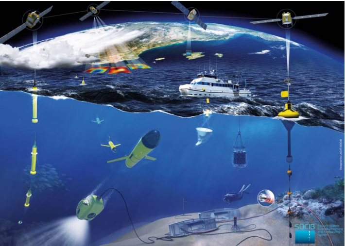



## Tipos

Dependiendo del tipo de información que se desea capturar se utilizan diferentes medios. Para imágenes de muy alta resolución, cubriendo áreas pequeñas se utilizan UAVs (vehículos aéreos no tripulados) y drones. 

Cuando se necesitan imágenes de alta resolución, pero con una mayor cobertura se utilizan aviones o helicópteros. 

Por último, cuando se necesitan cubrir áreas muy amplias se usan satélites, de baja, media o alta órbita terrestre en los que encontramos resoluciones de todo tipo. 

No obstante, cuando hablamos de Remote Sensing generalmente nos referimos a la información que se obtiene a través de los diferentes sensores que utilizan los satélites para obtener datos de la tierra, desde la atmosfera y los océanos a ciudades o zonas terrestres ya que ofrecen una mayor información espacial. Mientras tanto los UAVs, helicópteros y demás se utilizan para resolver problemas locales.

## Datos Satelitales, los mas comunes 

Pese a que en Remote Sensing se utilizan muchos tipos de datos, los más comunes son imágenes satelitales. Sin embargo, estas imágenes contienen mucha más información que las que acostumbramos a obtener con cámaras normales, tanto en resolución espacial como espectral. 

### Bandas Espectrales 

Al aumentar el área que se cubre se suele perder resolución espacial, pero hay satélites capaces de obtener resoluciones de 50 cm por píxel (cuadrado). En cuanto a la resolución espectral muchos de estos datos son imágenes multiespectrales, es decir que contiene varias bandas que contienen información que el sensor es capaz de captar en un conjunto de longitudes de onda; o hiperespectrales, que contiene bandas con muchas menos longitudes de onda, pero puede contener cientos o miles de bandas.

### Para Clarificar:

El satelite Sentinel 3 de la ESA lo tomaré como ejemplo ya que es el satelite que me parece mas aplicable al oceano con su sensor OLCI (Ocean and Land Colour Instrument).

>OLCI contiene 21 bandas espectrales (400-1.020 nm) con un haz de 1.270 km

Por ejemplo la banda 1 de OLCI capta longitudes de onda de alrededor de 400 nm (nanometros), las cuales son las encargadas de la corrección de aerosoles y recuperación mejorada de componentes del agua.

La banda 8 de los datos que recoge OLCI se ubica en los 665 nm y es la que toma los componentes de clorofila, sedimentos y substancias de color amarillo. 

Para tomar informacion especifica se toman conjuntos de bandas (por ejemplo 8,6,4) que contienen numeros o datos crudos. Mediante procesos establecidos a traves de software, ecuaciones(algoritmos) se obtienen los datos deseados, ej: concentracion de clorofila.

