Es importante empezar aclarando los niveles de procesamiento en que vienen los datos/productos satelitales. 

Los niveles de procesamiento pueden ser de:

- nivel 0: que abarcan mediciones sin procesar, datos crudos.

- nivel 1: conjuntos de datos con cierto control de calidad.

- nivel 2 o superior: derivados y productos de síntesis de modelos-algoritmos.

*clave:*
**En este tutorial vamos a trabajar con datos de nivel 1 (L1) y mediante SNAP (el Software de la Agencia Espacial Europea ESA para trabajar productos sentinel) procesaremos la imagen para obtener productos de nivel 2 (concetracion de clorofila y materia total suspendida MTS)**

## Copernicus Hub

[Copernicus Hub](https://scihub.copernicus.eu/) es la plataforma para descargar productos de todas las misiones sentinel. En el link OpenHub puedes ingresar y registrarte.

### Descargar un producto Sentinel 3 nivel 1 (L1). 

Especificar en el mapa algun polígono (área) de interés. Especificar un rango de fechas (sensing dates), la mision (sentinel 3) y el tipo de instrumento (este caso OLCI).

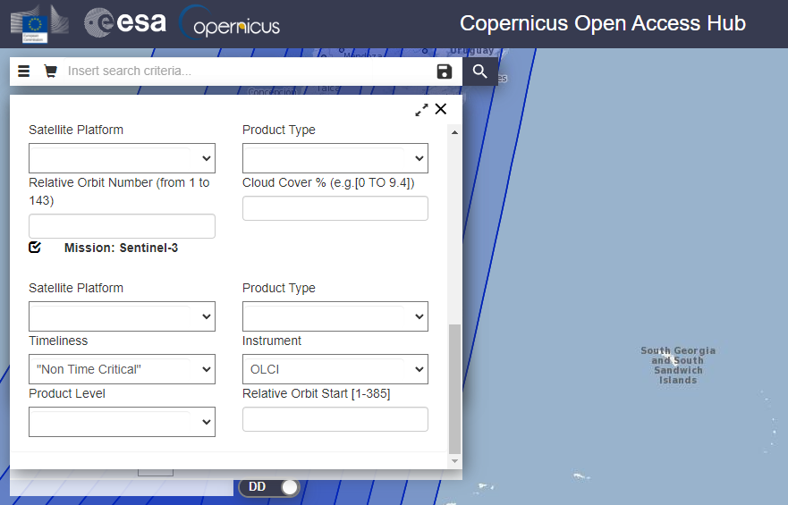

La carpeta del producto tiene alrededor de 550 y 700 MB de tamaño. Trate de escoger un producto con pocas nubes. Descargue y posteriormente extraiga todo del archivo zip.

## SNAP

Si no tiene el software SNAP para trabajar productos Copernicus (Imagenes Sentinel) lo puede descargar [aquí.](https://step.esa.int/main/download/snap-download/)

### 1. Product Explorer
Arrastre la carpeta resultante de la descarga del Copernicus Hub al software SNAP a la parte superior izquierda denominada "Product Explorer".

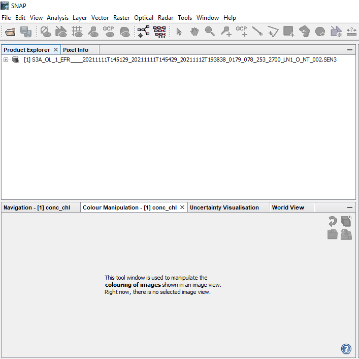

### 2. Imagen RGB
Haga clic con el botón derecho en el archivo del "Product Explorer" y seleccione "Abrir la ventana de imagen RGB" o "Open the RGB Image Window" para visualizar el producto. Para Sentinel 3 puede elegir las bandas 8, 6 y 4 respectivamente.

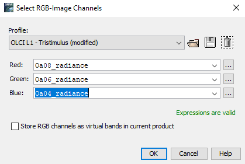

### 3. Subset
>Es mejor trabajar con subproductos/subconjuntos/subsets (partes del archivo original o áreas específicas) porque la manipulación de un producto completo puede llevar mucho tiempo y recursos informáticos.

- Producto Completo (lo que se descarga en el Copernicus Hub)

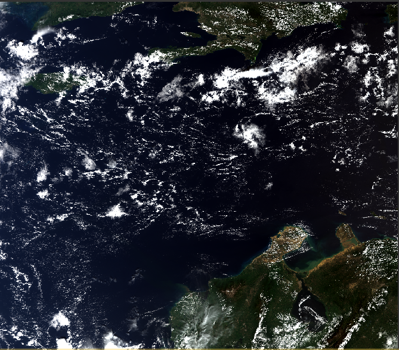

- Subset (área de ínteres del producto completo)

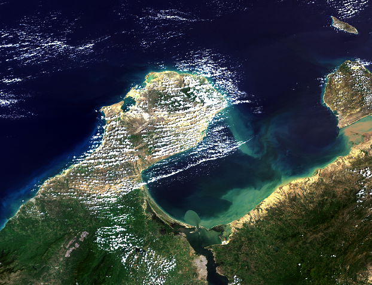

**Para crear un subproducto,** haga clic en Ráster (en la barra de herramientas) y luego en Subset.

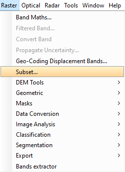

### 4. Tipos de Subsets
Es posible realizar: Subset Espacial (Spatial Subset), Subset de Bandas (Band Subset), Subset de Cuadrícula Tie-Point o Subset de Metadatos. 

Por ejemplo, si desea tener un área específica de estudio en más de un producto descargado, puede elegir el subset espacial (Spatial Subset) y la opción Geo Coordinate.

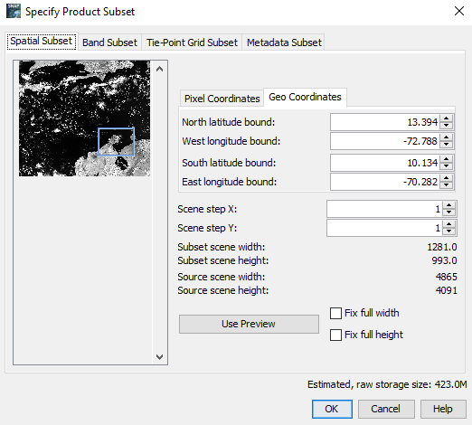

### 5. Trabajando con un Subset
Después del proceso del subset del producto original, el sub-producto aparecerá en el Explorador de Productos.

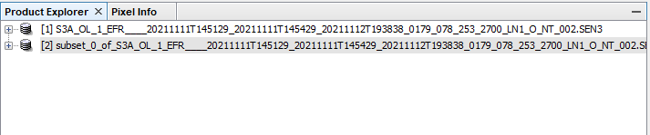

Puede abrir el nuevo subset siguiendo el paso 2.

## OLCI PROCESSOR

Hora de procesar el subproducto para hallar concentraciones de clorofila (conc_chl) y materia total suspendida (conc_tsm) mediante la funcion "Procesadores OLCI".

Vale la pena recordar que OLCI (Ocean and Land Colour Instrument) es el sensor del satélite Sentinel-3 que toma las medidas con las que estamos trabajando.

### 6. C2RCC
- Seleccione el subset con el que va a trabajar

- En la barra de herramientas, seleccione la opción Optical. Haga click en "Procesamiento temático agua" (Thematic Water Processing), luego en "Procesadores C2RCC" (C2RCC Processors) y finalmente en "OLCI".

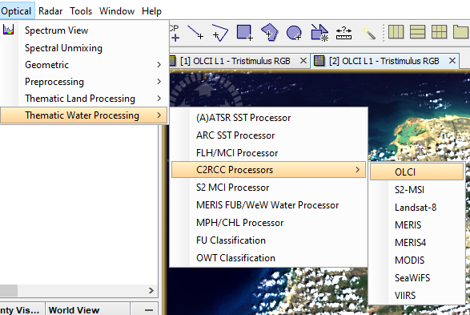

### 7. Parametros
Después del paso 6 aparecerá una ventana. Es importante tener en cuenta un par de cosas:

- En **I/O Parameters:**

  - confirme que en *OLCI L1b product* esté el subset correcto.

  - elija el directorio (Directory) donde va a guardar los subsets de clorofila y tsm.

  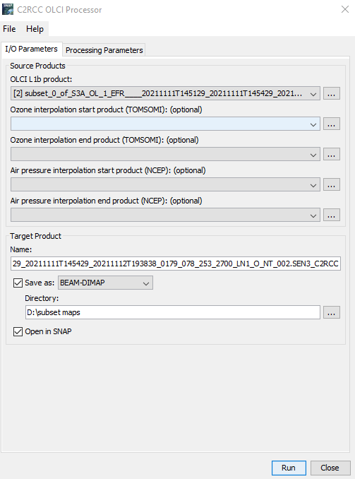

- En **Processing Paramets:**

  - elija la Salinidad (Salinity) y Temperatura (Temperature) correctas del lugar donde este trabajando. Por ejemplo, en el Caribe colombiano la temperatura media durante el último año fue alrededor de unos 28°C y la salinidad de 35 PSU. En otros lugares las temperaturas pueden bajar drasticamente, tambien la salinidad.

  - deje las otras opciones por defecto pero recuerde ser consciente de las propiedades físicas en el área de estudio.

  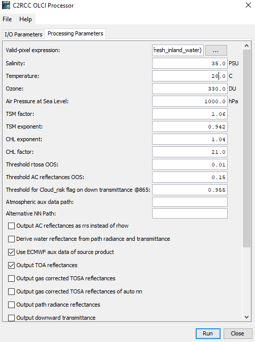

>Después de estas consideraciones ejecute el modelo, tomará un par de minutos (depende de sus recursos *in-silico*).  

## Chl (clorofila)

### 8. conc_chl
Después de ejecutar el modelo, aparecerá un subset nuevo en "Product Explorer", en este caso es el número 3.

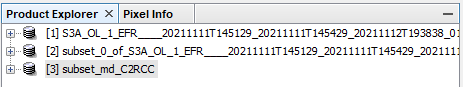

Busque **conc_chl** en el nuevo subset y ábralo con un doble click

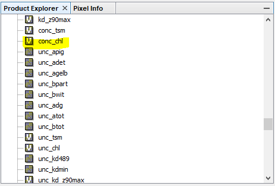

### 9. Paleta de colores
Es difícil reconocer un patrón porque la imagen está en blanco y negro. Vaya al cuadro "Manipulación de color" (Color Manipulation) que se encuentra debajo de "Product Explorer". Haga click en el icono "importar paleta de colores desde archivo de texto" (import colour palette from text file) en la parte derecha.

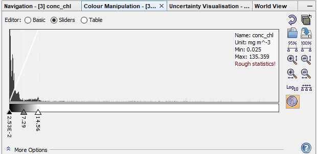

En la ventana que aparece (recuadro de abajo) escoja la paleta de su preferencia. El **"cc_chl.cpd"** es una buena opción para la clorofila (chl).

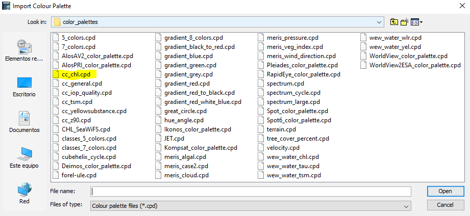

- Ejemplo de Imagen Resultante

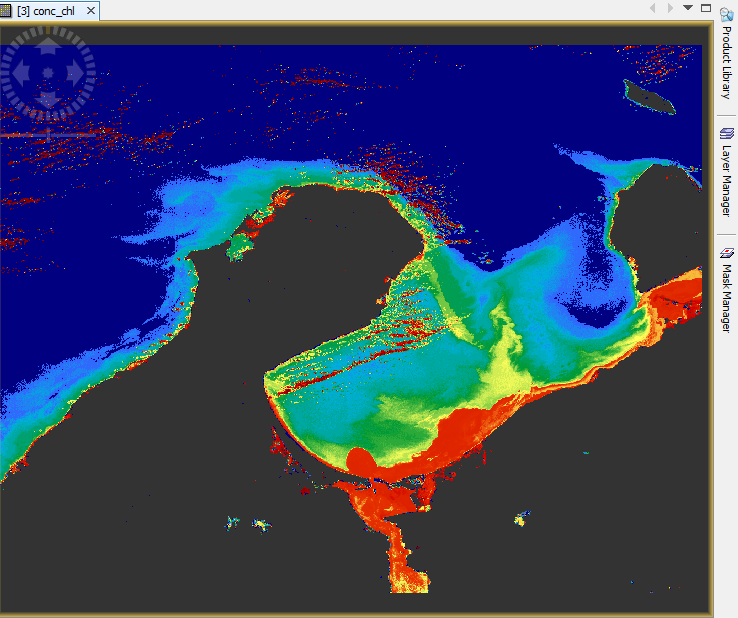

### 10. Correción de nubes
>Es importante hacer una **correción de nubes**.

Haga click en el "Administrador de máscaras" (Mask Manager) que está en el lado derecho de la pantalla (puede verlo en la imagen anterior) y elija la opción "Cloud_risk". 

Puede elegir otras banderas para obtener mejores resultados. Por ejemplo, "quality_flags_land".

>La nueva imagen resultante tiene píxeles de nube en gris y tierra en verde oscuro.

Para englobar las **correcciones de nubes,** haga click derecho en **conc_chl** en el Explorador de Productos y vaya a "Propiedades". Aparecerá la siguiente ventana.

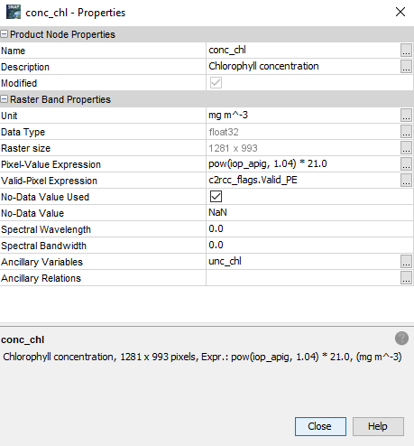

Haga click en "Expresión de píxel válida" (Valid-Pixel-Expression). Complete la expresión inicial agregando: **&& !Cloud_risk** como aparece a continuación.

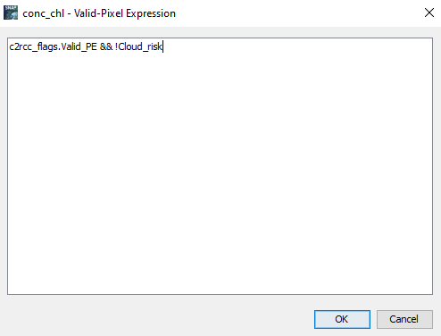

>Repita los pasos anteriores de correcion de nubes para **unc_chl** (errores o incertidumbres de los valores de clorofila) en el Explorador de Productos.

## Tsm (materia total suspendida)

Para los Productos Tsm que son **conc_tsm** y **unc_tsm** repita los pasos 8-10 que se hicieron con Chl (clorofila).

Cuando elija en la paleta de colores (paso 9), escoja la opción "cc_tsm.cpd" que es la adecuada para este tipo de productos.

Realice la corrección de nubes (paso 10) y la imagen resultante debería ser como:

>Realice el paso 10 en el que se engloban las correcciones de nubes para **unc_tsm**.

## Guardar Productos
Si completó los pasos 8-10 haga click derecho en los productos que trabajó (conc_chl, unc_chl, con_tsm, unc_tsm) y elija "Convertir banda" (Convert Band) para cada uno de los 4 casos.

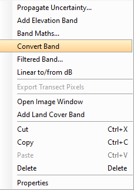

Vaya al subset donde trabajó y "Guardar producto" (Save Product).

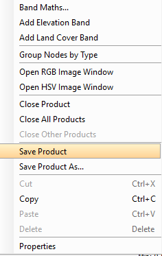

Finalmente puede ir a Archivo (en la barra de herramientas) y exportar el producto en el formato de su conveniencia (NetCDF4, GeoTIFF u otro).

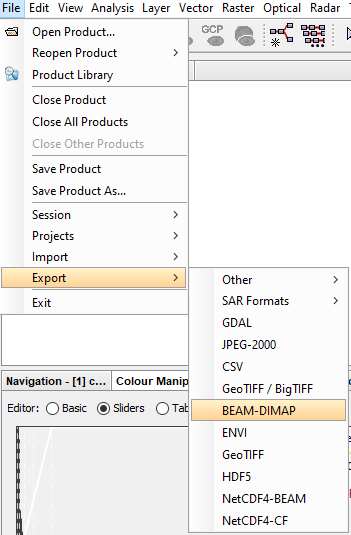

